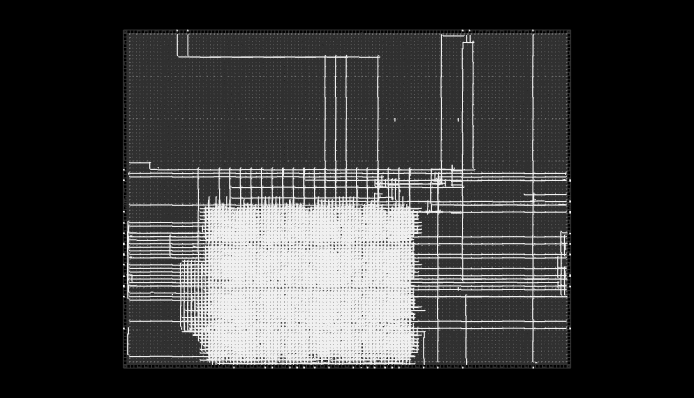

# GPU Core - Experimental SIMD Accelerator

A vector ALU coprocessor written in [Brief](https://github.com/Randozart/brief-lang).

 

## Architecture

### V1 (Legacy)
- **256 parallel lanes** of 16-bit computation
- **AXI4-Lite interface** for MMIO
- Flip-flop based vector storage (Resource intensive)

### V2 (Functional)
- **32 parallel lanes** (Verified & Synthesizable, Scalable to 256)
- **Automatic BRAM Inference**: Internal buffers are mapped to Block RAM via `hardware_lib`
- **IO vs. Memory Separation**: Prevents "pin explosion" by strictly separating physical pins (`[io]`) from internal silicon storage (`[memory]`)
- **Compile-Time Validation**: Compiler detects "Dead Hardware" (Orphan Variables/Untriggerable Transactions)
- **Extended ISA**: Bitwise XOR (`^`), Shift Left (`<<`), Shift Right (`>>`), and ReLU selection

## Hardware Specification System

Brief-Verilog uses a three-layer hardware specification system to map logic to silicon:

1. **Brief (`.ebv`)**: Pure behavioral logic and data flow.
2. **Hardware Library (`hardware_lib/`)**: Reusable specifications for interfaces, memory types, and FPGA targets.
3. **Project Config (`hardware.toml`)**: Maps project variables to physical pins or internal storage.

### Validation Layer (Safety)
The compiler performs static analysis to ensure your Brief code translates to functional hardware:
- **EBV001 (Orphan Variable)**: Variable is never written to. Logic would be optimized away.
- **EBV002 (Dead Transaction)**: Precondition can never be met. Transaction is unreachable.

## Memory Map (V2 Functional)

| Address | Signal | Type | Description |
|---------|-----------|------|--------------|
| 0x40000000 | `cpu_control` | **trg (Input)** | Command (1=Load Ping, 2=Load Pong, 3=Exec, 4=Read) |
| 0x40000004 | `status` | **let (Output)** | Internal status (0=Idle, 1=Busy, 2=Done) |
| 0x40000008 | `cpu_opcode` | **trg (Input)** | ALU operation selection |
| 0x40000040 | `cpu_write_data`| **trg (Input)** | Data value to write to buffers |
| 0x40000044 | `cpu_write_addr`| **trg (Input)** | Buffer index (0-31) |
| 0x40000048 | `cpu_write_en` | **trg (Input)** | Commit write to Ping/Pong buffer |
| 0x4000004C | `cpu_read_en` | **trg (Input)** | High to fetch from Result Buffer |
| 0x40000050 | `read_data` | **let (Output)** | Data value read back |
| 0x40000010 | `ping_buffer` | **Memory** | Internal Silicon Staging A |
| 0x40000020 | `pong_buffer` | **Memory** | Internal Silicon Staging B |
| 0x40000030 | `result_buffer`| **Memory** | Internal Silicon Results |

## Operations (Opcodes)

| Opcode | Operation | Description |
|--------|----------|------------|
| 0 | Add | `a + b` |
| 1 | Sub | `a - b` |
| 2 | Mul | `a * b` |
| 3 | XOR | `a ^ b` |
| 4 | AND | `a & b` |
| 5 | Shl | `a << b` |
| 6 | Shr | `a >> b` |
| 7 | ReLU | `max(0, a)` |
| 8 | Mask | `b == 0 ? a : b` |

## Compilation

V2 requires a hardware configuration file to define the chip boundary:

```bash
./brief-compiler verilog gpu_core_v2.ebv --hw gpu_core_v2.toml --out v2_out
```

## Usage (Flow)

1.  Set `cpu_write_addr` and `cpu_write_data`.
2.  Pulse `cpu_write_en` with `cpu_control=1` to load **`ping_buffer`**.
3.  Pulse `cpu_write_en` with `cpu_control=2` to load **`pong_buffer`**.
4.  Set `cpu_opcode` and set `cpu_control=3` to **Execute**.
5.  Poll `status` until `2`.
6.  Set `cpu_control=4` and pulse `cpu_read_en` to read results from **`read_data`**.

## Performance & Efficiency Benchmarks

### 1. Raw Compute Throughput (32 Lanes)
- **Parallelism:** 32 Lanes
- **Operation Width:** 16-bit Signed Integers
- **Clock Speed:** 100 MHz
- **Cycles per Compute:** 1 Cycle
- **Peak Performance:** **3.2 GOPS** (Giga-Operations Per Second)
- **Peak Internal Bandwidth:** **51.2 Gbps**

### 2. Efficiency Analysis

#### Hardware Density (ECP5-85F Actuals)
- **Logic LUTs:** ~10,800
- **DSPs:** 32 (Mapped to MULT18X18D hardware multipliers)
- **Registers:** ~1,500 Flip-Flops
- **ALU Efficiency:** 100% utilization during the execution cycle.

### 3. Simulation & Verification
**Run Simulation:**
```bash
iverilog -g2012 -o gpu_sim v2_out/gpu_core_v2_tb.sv v2_out/gpu_core_v2.sv
vvp gpu_sim
```
